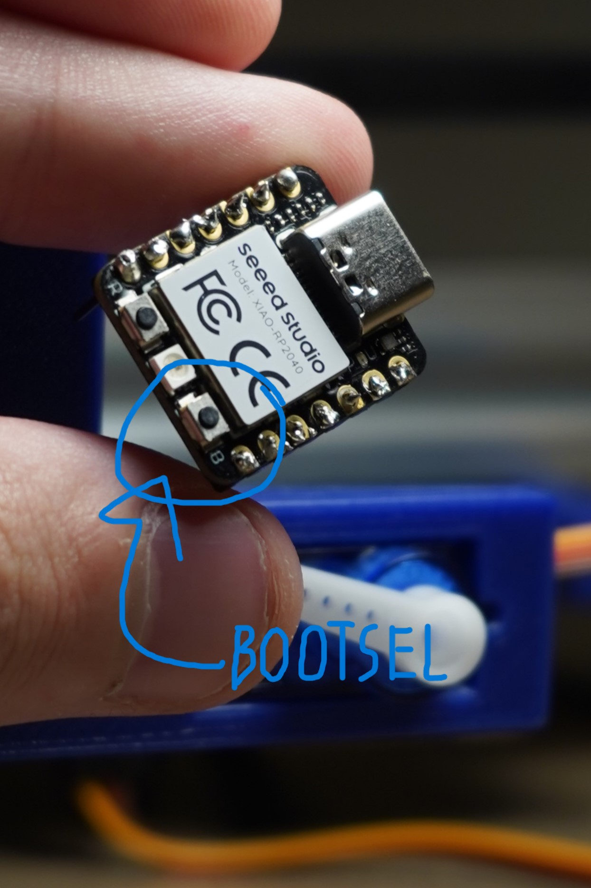
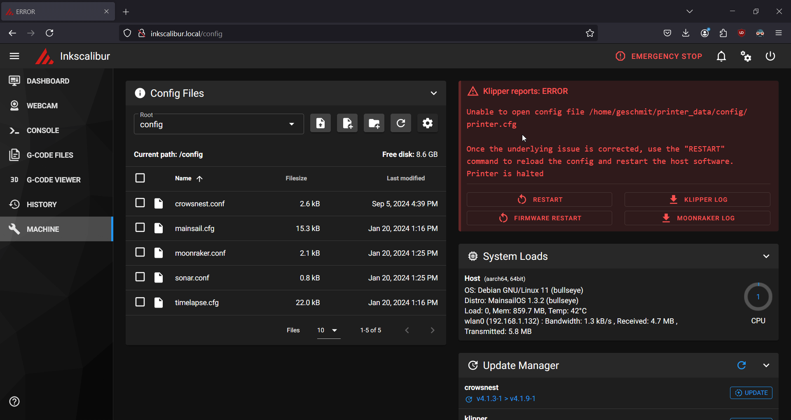

= Inkscalibur
:toc:

== Introduction
=== What is this?

This is a guide to get set up running https://github.com/Klipper3d/klipper[Klipper] in tandem with your https://blot.hackclub.com[Hack Club Blot], a drawing machine created by Hack Club. 

TIP: For high schoolers with proof of age and origin, you can ship a piece of artwork to be displayed on Hack Club's website and get over 100$ of drawing hardware for free! See more at https://github.com/hackclub/blot[@hackclub/blot].

=== What can this do?

* Interpret Gcode commands as drawing instructions
* Draw at much, much higher speeds than the stock firmware(an 8x difference w/o fine tuning!)
* Allow remote control via Mainsail
** Loading of drawings to be drawn without the need for a physical serial connection
** File storage of previous prints for ease of reprinting
* Full control over the XIAO RP2040's peripherals
** Includes the board's RGB LED and NeoPixel
* Enable the https://sprig.hackclub.com[Hack Club Sprig] to be used as a controller for moving the pen manually on the print bed 

=== What can this NOT do?

* Run code from the Blot web interface
* _Directly_ draw a SVG or other vector graphic
** You need to convert it to Gcode before plotting. Read the guide for more info on this subject.

== Prerequisites

image::imgs/required.JPG[500,500]

=== Required

* 1x Hack Club Blot drawing machine, assembled
** Includes PSU your Blot shipped with, or an equal or greater wattage(45W) USB-C PSU
** 1x USB-A -> USB-C cable to connect your Blot's XIAO RP2040 MCU to your Raspberry Pi
* 1x Raspberry Pi 3B+ or newer(a Zero, Zero 2 or any RP2040/Pico varient will not work)
** Additionally, a MicroSD card with 8GB or more in size to hold your operating system and plotted files, in addition to either a USB-C or USB-Micro B cable to power your Raspberry
* A drawing utensel(preferably, a pen)
** The smaller the ballpoint, the more detailed your drawings will be. I suggest https://www.pilotpenpromo.com/p/product/24696cce-0981-4d10-97de-16bc322b8752/g2-premium-gel-roller-pen-0-38mm[Pilot's G-2 0.38 MM] for the best quality and availability, but any old pen should do. In addition, I don't suggest using a Sharpie or other fineliner, as those will bleed and make thicker lines than what the tip is advertised to be.
* A computer with the Raspberry Pi Imager and 
* Topic knowledge
** Knowledge of how a 3D printer or CNC machine operates
** Experience with flashing a Raspberry Pi, as well as remote login via SSH

=== Optional

* 1x Hack Club Sprig, if you intend on using the gamepad configuration
** Additionally, a USB-A -> USB-Micro B cable to connect your Sprig to your Raspberry Pi
** This will allow you to use your Sprig as an input device for your Blot to input some basic movement commands.
* 1x USB Webcam
** This will allow you to view your Blot over the network while it's drawing your art.
** In this guide, I'm using a photography-grade camera to capture my drawing space, but any standard USB camera should work fine.

== Setup procedure

=== Things to do beforehand

* Unplug your Blot's power supply brick. We'll plug it back in only when everything is ready to be tested.
* Plug your MicroSD card into your computer.

=== Flash your Raspberry Pi

IMPORTANT: Ensure you have the Raspberry Pi Imager installed on your system before beginning this step.

Depending on which board you are using, instructions may vary. For this guide, we'll be using a Raspberry Pi 3B+, with a 16GB SanDisk MicroSD card.

Insert your MicroSD card into your computer and launch the imager. When prompted, select your device from the list. Then, when selecting an operating system, select `Other specific-purpose os` -> `3D Printing` -> `Mainsail OS` -> `Mainsail OS X.X.X - Raspberry Pi (64-bit)`. Finally, select your storage device and click next.

* This will setup your Raspberry with Klipper, Moonraker and Mainsail, which lets you configure your Blot remotely without the need to plug it into a keyboard or display.

NOTE: You need to apply customization settings in order to login over SSH- by default, your Raspberry won't know what network to connect with. If you haven't done a configuration with the imager before:

* When asked "Would you like to apply customization settings?", press edit settings to enter the setup dialog.

* Make sure all of the following are checked and set:
** *General*
*** Set hostname: Set this to a name you can remember when logging into your device. If you have hostname resolution for your router(chances are you do), you can substitute this in place of your Raspberry's IP address.
*** Set username and password: Choose a username and password you can login into the Raspberry with over the network. These are both case sensitive, so ensure you type them correctly and remember exactly what they are.
*** Configure wireless LAN: If you don't plan on using the Raspberry's ethernet jack, you can configure a WiFi network to connect with. The SSID is your network's name, along with your WiFi password. Most often, you shouldn't need to change the Wireless LAn country, but if you find issues later on, set this to your country's locale code.
*** Set locale settings: Set the timezone to your region's timezone. As you're connecting headlessly, you technically don't need to change the keyboard's layout, but you can also set this to your locale's identifier incase you change your mind later on.
** *Services*
*** Check "Use password authentication". This will allow you to use your username and password in place of a SSH key to login remotely.
* Close out of the dialog and press yes to apply the settings to your install.

WARNING: Clicking yes on the following dialog will erase all of the data on your MicroSD card. Pause for a moment and ensure what you have on there isn't worth pulling your hair out about!

Once the imager has completed flashing your MicroSD card, eject it and insert the MicroSD card into your Raspberry to continue.

=== Powering up & logging in

NOTE: Do NOT plug in your Blot just yet- we need to go in and change a few things beforehand.

Plug in your Raspberry and give it around 3-5 minutes for it to resize it's filesystem and connect to your network. Once that's passed, you can go ahead and give it a few pings to see if it responds, with the hostname you chose earlier:

image::imgs/shell_pings.png[500,700]

TIP: If it doesn't seem to be responding to be responding to your pings, try adding `.local` to the end of your host address- this seems to be the case especially on Apple devices.

Now, login to your Raspberry using `ssh username@host`, where username is the name you chose earlier and host is the host or IP address of your machine. In my case, my username is `geschmit` and my hostname is `inkscalibur`, so I'd use `ssh geschmit@inkscalibur` to login to my Raspberry. If it asks you to accept a key, type "yes" followed by enter- SSH is very picky about this being exact. Afterwards, enter your user's password. If all goes well, you'll get a shell to your Raspberry- you're in!

image::imgs/shell_login.gif[500,700]

=== Flashing your Blot's XIAO RP2040

Before you can continue with setting up the web interface, you must flash your microcontroller with Klipper's firmware. Thankfully, Mainsail OS has all of the requirements we need to compile it, so all you need to do is change a few things in the config menu to target the right chip you're using.

To ensure your steppers don't jam or likewise damage themselves, take your XIAO RP2040(the little black thing that says seeed studio on it) _completely_ out of your Blot and set it aside. You'll be flashing this in a moment, so also get a USB-C cable that you can plug into your computer.

_Behold, Shawn's mildly bad solder job, caught in (actual) 4K._

From your Raspberry's SSH session, paste this code in:
[,bash]
----
cd klipper
make menuconfig
make
----
* These commands will jump you to Klipper's directory and open the configuration dialog for building firmware.

From the dialog, scroll down to `Micro-controller Architecture`, press enter, scroll to `Raspberry Pi RP2040` and press enter again. This will initialize the configuration with the default values for this chip- you can leave all of these how they are and press Q to exit. When prompted, save your configuration by pressing Y.

TIP: Use your arrow keys to navigate menus.

* This will create and save a configuration, then immediately begin building your firmware. Depending on your system, this could take 2-4 minutes.

Once the build process is finished, you're ready to flash. While holding down the BOOTSEL button, plug your microcontroller into your Raspberry to put it into UF2 boot mode. This will advertise it to the system as being ready for a firmware update.

Now, tell Klipper to flash your microcontroller with:
[,bash]
----
sudo make flash FLASH_DEVICE=2e8a:0003
----
This tells Klipper to look for a Raspberry Pi device connected over USB. If successfully found, it'll quickly flash your microcontroller and get it ready for use. Once completed, unplug it from your Raspberry and reinsert it back into your Blot. Do NOT connect your Blot to your Raspberry once this is completed- we need to setup the Klipper configuration first.

WARNING: Functionality relating to the Blot web interface will not function until you reflash again with the stock Blot firmware.

=== Connecting to the Web UI & configuration

We're almost there! Just a few more steps and your Blot will be running smoothly in no time.

On your computer, open your web browser of choice to your Raspberry Pi's address. In this case, mine's http://inkscalibur.local/. This will direct you to the Mainsail UI, where you can see the status of your printer, peripherals configured and more.

Upon initially opening your UI, it should look something like this:

This is perfectly normal! Klipper is just mad it doesn't have a configuration to go off of, which we're going to add here in a moment.

Navigate to the Machine tab. This will display a list of configuration files Klipper is currently setup to use. Depending on what you want to setup with your Blot, you'll either add one of two files to this directory- one uses the Sprig as a gamepad, the other does not. Make sure you get the right one, or Klipper won't function properly!

|===
|Name |Config File

|Sprig Support
|https://github.com/geschmit/inkscalibur/blob/main/configs/InkscaliburSprig.cfg[Here]

|No Sprig Support
|https://github.com/geschmit/inkscalibur/blob/main/configs/Inkscalibur.cfg[Here]

|===

Once you have your config file downloaded, rename it to `printer.cfg`- Klipper is programmed to recognize this file name by default as the printer it is to be configured with.

Following, return to your machine tab and upload your chosen config by pressing the icon with an arrow on it. Plug in your Blot, click restart and give it a few seconds to reboot- if all goes well, you're all ready to start drawing with Klipper!

NOTE: If you chose the configuration with Sprig support, you still have some work to do. Jump down to the section containing information about the Sprig and follow those instructions before moving on.

== Drawing some art

Congratulations! You've got your Blot decked out with Klipper, and you're now ready to start drawing. But, how can we get your machine to cooperate?

=== Aligning the motors

Firstly, Klipper boots into a state where all steppers are disabled. To get it in a "ready" state, we need to home the plotter. On a normal plotter or similar 3D printer, limit switches would be put in place to help with this, but the Blot actually doesn't have any of those by default, so simply pushing the printhead back to zero to center it manually works fine.

Before plugging in your Blot's PSU, push the printhead to the bottom left corner of your machine- this *MUST* be done, or else your Blot may start veering off-axis or jamming.

image::imgs/plotter_home.gif[500,1000]

After this is done, return to your Klipper's dashboard and press the "home all" button on the toolhead dialog- this will assume the motors are all at zero.

=== Aligning the servo

The servo your Blot ships with may vary, so it's key you get yours aligned correctly to save time moving the pen up and down. 

Navigate to the Klipper's console tab, place a piece of paper under your blot and insert the pen mount into your Blot if you haven't already. In the console "send code" dialog, insert this line:

[,gcode]
-----
SET_SERVO SERVO=Pen ANGLE=XXX
-----

Where the XXX is the angle you want to set the servo to. Try a range of numbers from 0-180, with an optimal distance of 45 degrees between the pen being up and down. Once you have determined these values, write them down and navigate back to the machine tab and click on printer.cfg.

In a section that looks like this:

image::imgs/webui_servoconf.png[500,500]

Replace the angle in `gcode_macro M5` with the angle at which your Blot's pen is up, and `gcode_macro M3` with the angle when your pen is down. Once complete, click save & restart to apply your settings to your Blot.

* These remap the Marlin https://marlinfw.org/docs/gcode/M003.html[laser] https://marlinfw.org/docs/gcode/M005.html[control] Gcodes to instead control the servo.

=== Sending Gcode

IMPORTANT: Now's the time to plug in your Blot's power supply. Do it before proceeding with the next step.

Once you've homed and calirated your blot, it's time to finally draw something. Download https://github.com/geschmit/inkscalibur/blob/main/gcode/Borpheus.gcode[this] Gcode file, click the upload & print dialog on your dashboard, and watch your Blot print out a picture of Borpheus, the Blot mascot!

image::imgs/plotter_borpheus.JPG[500,1000]

=== Creating new art

There are a variety of different ways to create Gcode for your plotter:

|===
|Name |Source |Installation/Usage| Supported file types| Notes

|Inkscape GcodePlot Extension
|https://github.com/arpruss/gcodeplot[@arpruss/gcodeplot]
|https://wiki.opensourceecology.org/wiki/Using_Inkscape_to_Generate_Gcode#GcodePlot_Extension_Install[Install guide]
|All supported Inkscape files
|Use the configuration specified https://github.com/geschmit/inkscalibur/blob/main/imgs/inkscape_exporting.png[here] when exporting.

|svg2gcode
|https://github.com/sameer/svg2gcode[@sameer/svg2gcode]
|https://sameer.github.io/svg2gcode/[Website]
|SVG
|Set the "Tool On" and "Tool Off" sequences to `M3` and `M5` in settings respectively.

|===

TIP: When designing a piece of art, it should always be 125x125 mm or smaller. Anything larger will be outside of the bounds of what the Blot is(by default) physically capable of reaching.

== Optional accessories

=== Cameras

When setting up a webcam, https://docs.mainsail.xyz/overview/settings/webcams[these] https://crowsnest.mainsail.xyz/configuration/cam-section[resources] will be of use to you. By default, crowsnest is automatically installed on the system and the config file for it can be found inside the machine tab on the web UI.

=== Sprig Gamepad

Your Sprig must be flashed in the same way as the XIAO RP2040 is before it can talk to your Raspberry Pi. Connect your Raspberry Pi Pico to your Raspberry Pi in BOOTSEL mode, and follow the guide above to run `make flash` to flash the UF2 to it.

TIP: Before flashing, unplug your Blot from the Raspberry Pi. As both devices use the RP2040 chipset, Linux won't be able to tell which is which. However, the upside is you can compile the firmware once and it'll run on both devices without any changes.

After this is completed, plug your Blot back in, open the web UI and restart your system. If all goes well, you should be able to execute Gcodes from the buttons on the Sprig:

|===
|Keys |Axis or Function

|W, S
|Y-Axis Jog

|A, D
|X-Axis Jog

|I, K
|Pen up/down

|J
|`M74`/Disengage stepper enable

|L
|`G28`/Zero axies and enable steppers

|===

== Supplimentary material

=== Tips & Tricks

* When printing, use masking tape to hold your paper in place.
* If you need to recalibrate your machine at any time, run `M74` to disengage the stepper enable pins to freely push the printhead back to zero. Afterwards, make sure to rehome the machine in the interface!

=== Links

* Repositories
** https://github.com/hackclub/blot[@hackclub/blot] - Blot source repository
** https://github.com/beardicus/awesome-plotters[@beardicus/awesome-plotters] - Curated list of plotting resources
* Websites
** https://blot.hackclub.com/[Hack Club Blot website]
** https://sprig.hackclub.com/[Hack Club Sprig website]
* Art
** https://blot.hackclub.com/gallery[Blot art gallery]
** https://plotterfiles.com/[PlotterFiles] - Free SVG art for plotting machines, usually licensed under Creative Commons
* Firmware
** https://github.com/hackclub/blot/blob/main/hardware/motor-control-board/firmware/uf2/firmware.ino.uf2[Stock firmware for the Blot]